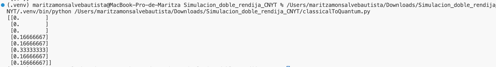
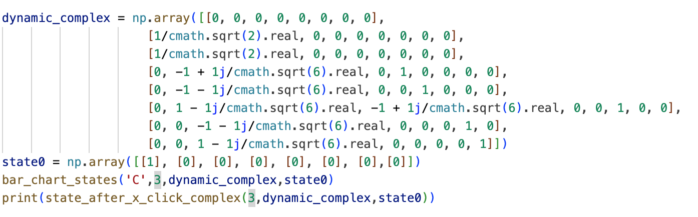

# Experimento Doble Rendija

En este repositorio encontrarán todo lo relacionado con el experimento del fenómeno de la doble rendija, junto con la explicación fundamentada en los principios de la computación cuántica.

## Objetivo

La finalidad de este experimento es investigar y comprender la forma en que las partículas, centrados específicamente en los electrones, se comportan cuando son expuestas a ciertas condiciones y entornos específicos. Con el objetivo de profundizar el conocimiento sobre estas partículas, estaremos sometiéndolas a la presencia de dos rendijas en una barrera. Por medio de este estudio, queremos conseguir una visión más completa y precisa del comportamiento de las partículas subatómicas.

## Introducción

El **experimento de la doble rendija** fue propuesto por el físico ingles _Thomas Young_ en 1801 para demostrar el comportamiento de la luz como una onda y que al pasar por una doble rendija generarian interferencia entre si formando un patron muy caracteristico de franjas claras y oscuras en una pantalla. En el siglo XX se reinterpreto los resultados del experimento, exponiendo partículas como los electrones a que pasaran por la doble rendija y obteniendo el mismo patron generado por la interferencia. Este experimento nos permite comprender la dualidad onda_partícula y el principio de superposición cuántica.

## Explicación del experimento

Para el desarrollo estaremos utilizando un apuntador laser que al encenderlo lanzara un haz de electrones hacia una placa de aluminio con dos rendijas cortadas lo mas juntas posibles. Cada uno de los electrones del haz tiene la misma posibilidada de pasar por una de las dos rendijas, pero es imposible que pase por las dos al mismo tiempo. Se esperaria que los electrones formen un patron en la pantalla de puntos acumulados uno a la derecha y otro a la izquierda.

Sin embargo, al observar los resultados del experimento, nos damos cuenta que se genera un patron inesperado.

Podemos plantear diferentes explicaciones, pero nos centraremos en que los electrones despues de pasar por una de las rendijas no estan siguiendo la trayectoria en linea recta como esperamos sino que cambian de dirección impactando en cualquier parte de la pared, pero este efecto solo se podria ver si algo o alguien esta interfiriendo, ya que, según la naturaleza del experimento los electrones deberían mantener su dirección original. 

Desde esta nueva explicación podremos incluir a la física cuántica y su teoria que involucra que un __elemento__ o __objeto__ perteneciente a un universo distinto es el encargado de modificar la trayectoria de los electrones del haz, lo que genera ese cambio de patrones de acumulacion de puntos a una linea de particulas.

Esta teoría plantea la posibilidad de hablar sobre el multiverso, donde las partículas en nuestro universo tienen versiones alternativas de sí mismas en otros universos, y estas versiones pueden interactuar entre sí, afectando los resultados observados en nuestro universo.

## Simulación

Para realizar las simulaciones, utilizamos un enfoque basado en un modelo matemático que se fundamenta en los grafos del sistema y en las matrices de adyacencia que se aplican a estos grafos. Luego, ejecutamos una simulación utilizando una biblioteca específica de Python para manejar números complejos, importando dicha biblioteca desde GitHub. https://github.com/Mar972310/Simulacion_doble_rendija_experimento_CNYT.git

## Explicación teórica 

Podemos plantear las probabilidades con coeficientes reales y/o complejos

### Coeficientes reales

Empezaremos con la explicación de cuando solo encontramos coeficientes reales, tendremos que los nodos 1 y 2 (intermedios) interactuaran como las rendijas del sistema y los nodos del 3 al 7 (finales) estaran sometidos a la misma condición de que se apuntaran a ellos mismos y la probabilidad sera de 1.

Matriz de adyacencia

Para realizar poder calcular las probabilidades de donde estará ubicada la particula déspues de N clicks será $M^{NClicks} \cdot x_{0}$, consideremos que el $x_{0} = [1,0,0,0,0,0,0,0]^{T}$

Luego de ejecutar un solo cick tendremos las siguientes probabilidades.

Después de dar dos clicks es donde notaremos que se comienza a generar interferencia, ya que los fotones de luz se dispersan en varios blancos u objetivos del experimento. Esto se debe a la física cuántica y la teoría de los multiversos (como parte de la simulación).

### Coeficientes complejos

Tendremos la misma explicación que cuando manejamos coeficientes reales, pero con los complejos podremos hacernos una mejor idea de las probabilidades que nos da el sistema, el modelo que obtendremos será el siguiente:

Matriz de adyacencia

Para realizar poder calcular las probabilidades de donde estará ubicada la particula déspues de N clicks será $M^{NClicks} \cdot x_{0}$, consideremos que el $x_{0} = [1,0,0,0,0,0,0,0]^{T}$

Después de dar dos clicks es donde notaremos que se comienza a generar interferencia, ya que los fotones de luz se dispersan en varios blancos u objetivos del experimento. Esto se debe a la física cuántica y la teoría de los multiversos (como parte de la simulación).

## Elaboración

### Materiales :
- Cartón paja
- Cartulina negra
- Laser
- Bisturi
- Papel aluminio
- Cinta transparente
- Caja

### Procedimiento:

1. Tomaremos un cuadrado de papel aluminio de unos 7 cm aproximadamente de lado y le haremos dos cortes con el bisturi lo mas juntos posibles.
2. Cortaremos un cuadrado de carton paja de unos 12 cm aproximadamente y a este le haremos en el centro un hueco de unos 6 cm de cada lado.
3. Pegamos el cuadrado de aluminio al de carton paja con cinta.
4. Lo que realizamos anteriormente lo pegaremos en una de las esquinas de la caja que fue forrada con cartulina negra.
5. Ubicamos el láser sobre la caja de la manera que apunte a la doble rendija para reflejar el efecto en una superficie.

### Video explicativo:

https://youtu.be/Dkhu42E3hKk

### Resultado

https://youtu.be/GIZdywsRSMo

 
